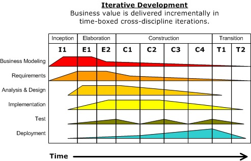
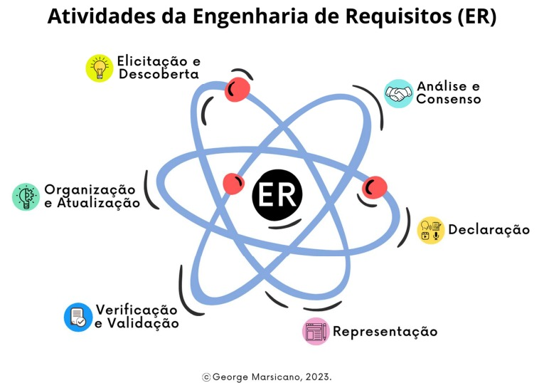
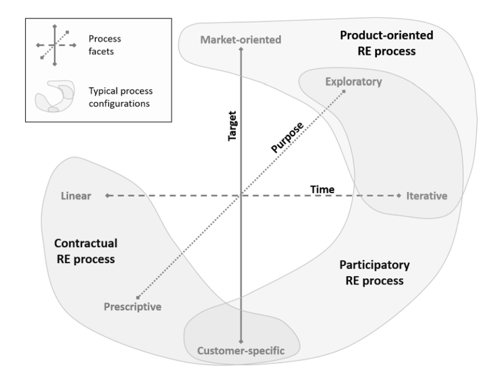

## 3. Processo de desenvolvimento de software

### 3.1 Metodologia

Levamos em conta as três natureza distintas apontadas por Sommerville: Técnicas, Humanas e Organizacionais. para formular perguntas que nos guiaram a abordagem de processo mais indicada para o nosso projeto.

- **Questões Técnicas:**  

  O sistema está sujeito a controle externo? <b>Não</b>. 
  Que tipo de sistema está sendo desenvolvido? <b>Um aplicativo android</b> 
  Qual o tamanho do projeto? <b>É um projeto pequeno</b>

- **Questões Humanas:**  

Quais abordagens de desenvolvimento os desenvolvedores são familiarizados? <b>
Toda a equipe está familiarizada com o Processo Unificado.</b> 
Quais tecnologias estão disponíveis para apoiar o desenvolvimento do sistema? <b>Flutter, Android Studio e Python</b>

- **Questões Organizacionais:**  

É necessária uma especificação detalhada antes de começar a fase de implementação 
do projeto? <b>Sim. A maior parte dos requisitos já são conhecidos.</b>
 Um esquema de entrega incremental é 
realista? <b>Sim</b>. 
O cliente está disposto e disponível para participar do time de desenvolvimento?
<b> Sim. Temos contato próximo ao cliente o que nos garante sua participação no
projeto.</b>

### 3.2 Abordagem, Ciclo de Vida e Processo de Software

  
 &emsp;&emsp;
Após a discussão em equipe foi definida o seguinte viés de desenvolvimento:

| Abordagem | Ciclo de Vida| Processo | 
| :---: | :----: | :-------: |
| Dirigida a plano| Iterativo-Incremental|Processo unificado|

 Dessa forma com o processo definido, será seguido a seguinte sequência de elaboração: 

Figura 1: Diagrama do Processo Unificado.

 &emsp;&emsp;
&emsp;&emsp;A escolha do processo foi direcionada devido às suas fases claras de desenvolvimento as quais se encaixaram de forma certeira com o Processo de engenharia de requisitos.

### 3.3 Tarefas

&emsp;&emsp;Por fim, diante do processo de desenvolvimento estabelecido, é necessário relacionar tal, ao processo de engenharia de requisitos, que tem as seguintes fases:  

Figura 2: Especificação da ER.

 &emsp;&emsp;A seguir pode ser conferido como foi definido as fases da engenharia de requisitos, os métodos, ferramentas e artefatos produzidos ao final da etapa, tais fases não são inflexíveis e podem mudar e adequar-se ao contexto em que se encontra o processo 

|Atividade | Método | Ferramenta | Artefatos |
| :---: | :----: | :-------: | :---: |
| Elicitação e Descoberta| Entrevistas e análise de requistos | Teams  | Especificação, caso de uso, pedidos do cliente, esboço inicial|
|Análise e Consenso| Caso de Uso, Brainstorming, Conversas com o cliente, Análises de custo e benefícios, Análises de valor, Análise de Prioridade e Impacto ,Entrevistas, Prototipagem | Teams, discord e Github| Modelo de casos de uso|
|Declaração | Casos de Uso, Temas, Épicos, Uses Stories, Features|  Reunião e Uses Stories|Casos de uso e visão de requisitos|
| Representação | Diagrama UML |LucidChart e astah|  Diagrama de JCasos de Uso |
| Validação e Verificação| Casos de Uso, Uses Stories, DoR, Feedback, INVEST, Revisão em Pares | Vitest e jest | Feedback do produto|
| Organização e Atualização| Casos de Uso |Mural, Word, Github |Backlog do produto|

 

&emsp;&emsp;O Processo Unificado já possui uma ER, com determinadas tarefas a serem seguidas. Para desenvolver as atividades do projeto é necessário escolher uma abordagem que se adeque às especificidades do software, e para isso utilizaremos um método proposto pela IREB (2022) no qual é apresentado diferentes facetas e configurações 'típicas' para um processo de ER, representado na Figura 3. 

Figura 3: Facetas do processo de ER. IREB (2023).

 &emsp;&emsp;
Com base no que foi avaliado no sommerville e na abordagem de desenvolvimento já definida, identificamos a faceta do <b>Processo de ER Contratual</b>  compartilhava seus principais pontos. Os pontos definidos para o projeto foram:

<ul>
  <li>Customer-specific: o produto foi encomendado por um cliente específico, em que o cliente é a principal fonte de requisitos.</li>
  <li>Iterativo-incremental: devido ser um produto pequeno mas complexo, dividí-lo em pequenas iterações se torna uma forma de gerenciar e minimizar os riscos, às vezes, mas manter um constante linear de entregas é útil, em virtude das dependências entre as funcionalidades.</li>
  <li>Prescritivo: é um contrato e o dono do produto exige que as funcionalidades sejam implementadas.</li>
</ul>

## Etapas do Processo Unificado Aliadas às tarefas do Processo de Engenharia de Requisitos

 &emsp;&emsp;Com o propósito de facilitar a execução das tarefas durante o desenvolvimento do projeto, foram identificadas as tarefas a serem realizadas nas 4 fases do Processo Unificado. 

| Iniciação/Concepção | Elaboração| Construção | Transição |
| :---: | :----: | :-------: | :---: |
|   Elicitação e Descoberta|   Analise e Consenso, Organização e Atualização, Declaração e Representação   |   Organização e Atualização, Verificação e Validação |  Verificação e Validação |
| Identificação de stakeholders e suas necessidades, Elaboração de uma visão inicial do sistema e Definição de requisitos de alto nível funcionais e não funcionais | Refinamento e análise dos requisitos iniciais, Modelagem de casos de uso, diagramas e artefatos de modelagem e Priorização dos requisitos com base nas necessidades dos stakeholders | Desenvolvimento dos componentes do sistema baseado nos requisitos, Verificação da definição dos requisitos e Atualização contínua da documentação a medida que ocorrer mudanças | Validação final dos requisitos em relação ao sistema implementado, Preparação para a implantação do sistema no ambiente de produção e Treinamento de usuários finais com base nos requisitos de uso do sistema

### 3.4 Referências

> Handbook IREB CPRE Foundation Level, Version 1.1.0, september 2022.

> SCOTT, Kendall. The Unified process explained. Nov 26, 2001. Disponível em: <https://www.informit.com/articles/article.aspx?p=24671&seqNum=8>

> MARSICANO, George. Requisitos de Software: Introdução a Engenharia de Requisitos (ER). Brasília, 2023. Disponível em: <https://aprender3.unb.br/course/view.php?id=20236>. Acesso em: 16 set. 2023.

> SOMMERVILLE, Ian. Engenharia de software. 10.ed. São Paulo: Pearson Education do Brasil, 2018.

## Histórico de versão

| Versão  | Autor| Descrição | Data |
| :---: | :----: | :-------: | :---: |
|    1.0   |   Juan Pablo    |   Implementação do documento inicial |  27/09 |
| 2.0| Harryson, Jefferson, João Lucas, Juan Pablo, Leandro, Thiago |  Regulação e correção do documento | 27/09 |
