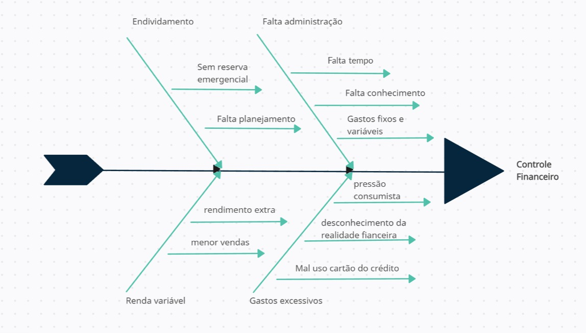

# Problema

 Foi identificado uma dificuldade de gestão de recursos financeiros por nosso cliente, desde a economia, gestão até formas de rendimento do dinheiro, logo foi proposto uma ferramenta que ajude na gestão financeira dos recursos individuais. 

## Posição do Produto

  Uma aplicação web de gestão de recursos financeiros pessoais que oferece ferramentas para ajudar o usuário a gerenciar suas economias. Este produto é de código aberto e totalmente gratuito. Nosso público-alvo inclui qualquer pessoa interessada em melhorar o controle de seus recursos financeiros. Nossa plataforma é amigável, simples e intuitiva, tornando-a acessível mesmo para aqueles com conhecimento limitado em finanças. 
 

|     Para      |                          **Público jovem-adulto que necessitem de controle de finanças.**                                                                             |
| :-----------: | :-------------------------------------------------------------------------------------------------------------------------------------------------------------------: |
|     Quem      |                                                     Público sem conhecimento de organização ou administração financeira.                                              |
| CarteiraControl |                                      É uma aplicação web : “CarteiraControl”                                                                                          |
|      Que      |                                            Ajuda no controle e gestão de finanças                                                                                     |
| Ao contrário  |                                Mobillis e organizze                                                                                                                   |
| Nosso produto |        Disponibiliza ferramentas e dicas de gestão financeira de forma acessível para qualquer usuário.                                                               |

## Objetivos do Produto

  O principal objetivo do CarteiraControl é fornecer aos usuários um sistema de gestão financeira abrangente. Com ele, é oferecido um ambiente integrado para gerenciar suas finanças, tornando a administração financeira mais eficaz e organizada. Além disso, é proporcionado uma experiência interativa e estruturada ajudando a alcançar suas metas financeiras, permitindo que acompanhem, sem dificuldades, o progresso de seus planos e a evolução de suas finanças. 

## Histórico de versão

| Versão  | Autor| Descrição | Data |
| :---: | :----: | :-------: | :---: |
|    1.0   |   Jefferson     |   Adiciona problemas, posição e objetivos do produto |  23/09 |
|    1.1   |   Leandro     |   Concerta a tabela |  24/09 |
