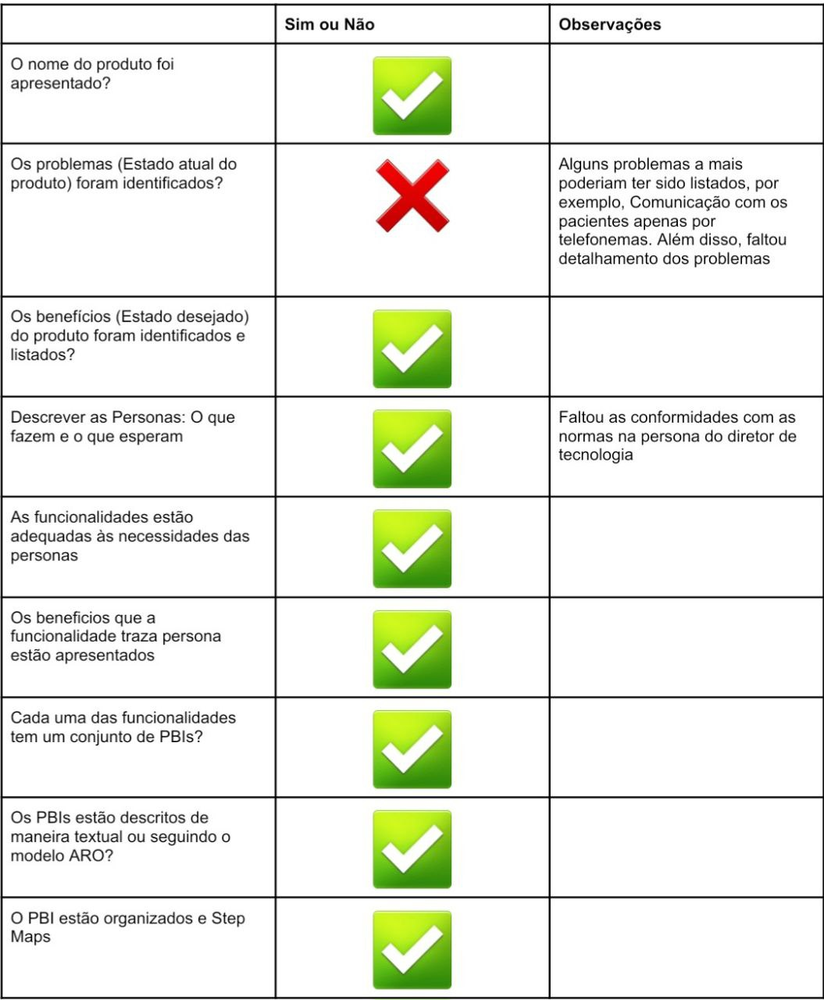
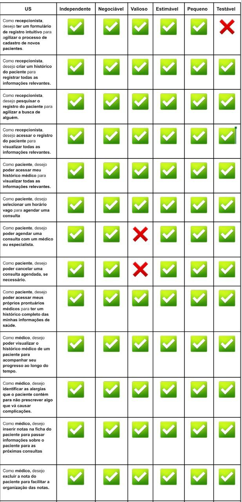
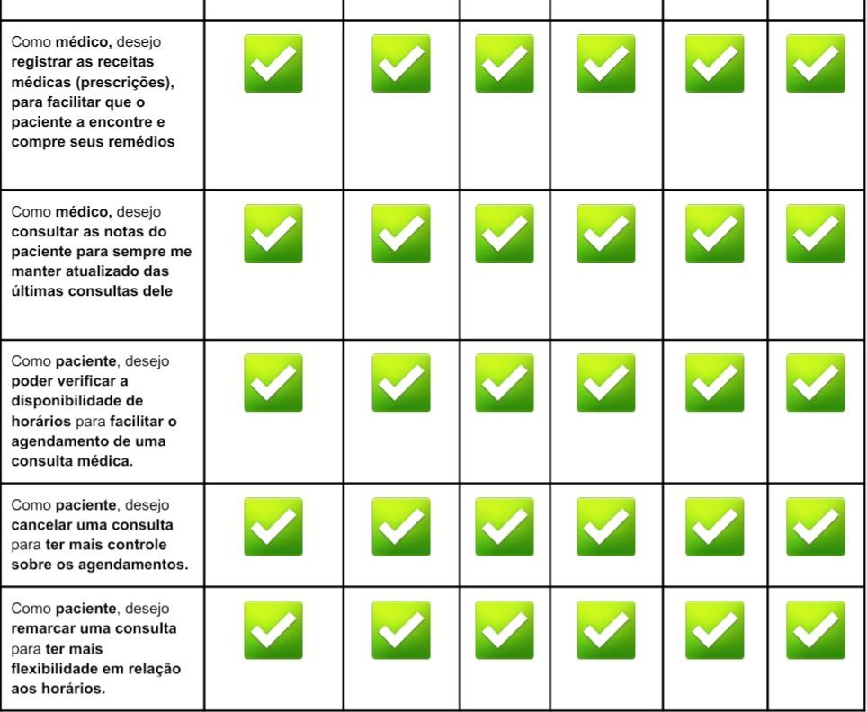

# Behavior Driven Development - Facção Tanás

 O BDD (Desenvolvimento Orientado a Comportamento) é uma técnica voltada a criação de software com base no comportamento do sistema. Com base nisso, é utilizado linguagem Gherkin para escrever especificações em formato simples e legível utilizando palavras como "Dado" (Given), "Quando" (When) e "Então" (Then) para estruturar as sentenças que descrevem o comportamento. Diante disso, o BDD utiliza cenários que descrevem a ação de uma história de usuário seguindo seus critérios de aceitação definidos. Esses cenários ajudam a validar se o software está se comportando conforme o esperado.

 Com base nisso, foi realizada atividades em sala de aula referentes ao BDD e PBB (Product Backlog Building). Dentre essas atividades, foi realizado a criação de cenários de BDD das histórias de Usuário do PBB da HealthNet da facção Tanás. Assim como a verificação e validação dessas histórias e versão inicial do PBB.

 Inicialmente foi realizado a Verificação e Validação da estrutura do PBB da facção Tanás. Para isso, foi realizado um checklist analisando pontos específicos. Segue abaixo, figura 1, o checklist com os resultados:

</figure>

<figure markdown>
<b>Figura 1</b> - Checklist PBB - Tanás

{width: 500}

Fonte: [Jefferson Sena](https://github.com/JeffersonSenaa).

</figure>

 Também foi realizado a Verificação e Validação das histórias de usuário geradas pelo PBB. Diante disso, foi utilizado a técnica INVEST para analisar se estão bem estruturadas e coerentes com o contexto da aplicação. A figura 2 apresenta os resultados obtidos.

</figure>

<figure markdown>
<b>Figura 2</b> - INVEST histórias de usuário - Tanás

{width: 500}

{width: 500}

Fonte: [Jefferson Sena](https://github.com/JeffersonSenaa).

</figure>

 Após a Verificação e Validação das histórias de usuário foi de fato criado os cenários de BDD dos critérios de aceitação das histórias seguindo a estrutura da linguagem Gherkin. 

## Persona Recepcionista

 História 1.1
Como recepcionista, desejo ter um formulário de registro intuitivo para agilizar o processo de cadastro de novos pacientes. 

- Cenário: Cadastro de paciente.
    - Dado que: O formulário é preenchido com dados válidos.
    - Quando: O paciente informar: 987.765.976-83, José Da Silva, 23/02/1970.
	- Então: Será cadastrado o novo paciente José Da Silva.

 História 1.2
Como recepcionista, desejo criar um histórico do paciente para registrar todas as informações relevantes. 

- Cenário: Histórico do paciente disponível.
    - Dado que: há dados válidos registrados em menos de 5 anos.
	- Quando: A recepcionista buscar os registros do paciente.
	- Então: Será emitido o histórico de todas as informações relevantes.

 História 1.3
Como recepcionista, desejo pesquisar o registro do paciente para agilizar a busca de alguém. 

- Cenário: Busca de registro de paciente existente no sistema.
    - Dado que: Há registro e cadastro válido do paciente.
	- Quando: A recepcionista buscar por José Da Silva, 987.765.976-83.
	- Então: Será apresentado o registro deste paciente.

 História 1.4
Como recepcionista, desejo acessar o registro do paciente para visualizar todas as informações relevantes. 

- Cenário: Acesso a Registro
    - Dado que: Há registro  e nota válidos do paciente nos últimos 5 anos.
	- Quando: A recepcionista acessa o registro do paciente.
	- Então: É apresentado todas as consultas e notas dos últimos 5 anos.

## Persona Paciente

 História 2.1
Como paciente, desejo poder acessar meu histórico médico para visualizar todas as informações relevantes. 

- Cenário: Acesso do paciente ao histórico.
    - Dado que: Há histórico válido do paciente nos últimos 5 anos.
	- Quando: O paciente solicita o acesso a seu histórico médico.
	- Então: É apresentado as informações das consultas, prescrições e notas das consultas dos últimos 5 anos.

 História 2.2
Como paciente, desejo selecionar um horário vago para agendar uma consulta . 

- Cenário: Confirmação do agendamento.
    - Dado que: Há horários vagos para agendamento de consultas. 
	- Quando: O paciente seleciona um horário vago.
	- Então: O hoŕario deve ser marcado e um email de confirmação deve ser enviado ao paciente.

 História 2.3
Como paciente, desejo poder agendar uma consulta com um médico ou especialista. 

- Cenário: Visualização dos horários.
    - Dado que: Há médicos e especialistas disponíveis para consulta.
	- Quando: O paciente realiza uma busca.
	- Então: Todos os horários dos médicos e especialistas devem ser visualizados.

 História 2.4
Como paciente, desejo poder cancelar uma consulta agendada, se necessário. 

- Cenário: Cancelamento de consulta agendada
    - Dado que: Que haja uma consulta agendada.
	- Quando: O paciente realiza a seleção da opção de cancelamento de consulta.
	- Então: O cancelamento da consulta deve ser alertado por e-mail para o médico e paciente.

 História 2.5
Como paciente, desejo poder acessar os resultados dos meus exames médicos para acompanhar minha saúde de forma conveniente . 

- Cenário: Visualização dos resultados dos exames.
    - Dado que: Há exames médicos realizados nos últimos 5 anos.
	- Quando: O paciente buscar os resultados dos seus exames médicos.
	- Então: Devem ser apresentados todos os exames médicos realizados nos últimos 5 anos e seus resultados.

 História 2.6
Como paciente, desejo poder acessar meus próprios prontuários médicos para ter um histórico completo das minhas informações de saúde. 

- Cenário: Visualização do histórico.
    - Dado que: Há no sistema um histórico de consultas do paciente disponível para visualização.
	- Quando: O paciente buscar o seu histórico de consultas.
	- Então: Deve ser apresentado um histórico de consultas detalhado, incluindo datas, médicos envolvidos e resumo de consultas.

## Persona Médico

 História 3.1
Como médico, desejo poder visualizar o histórico médico de um paciente para acompanhar seu progresso ao longo do tempo. 

- Cenário: Visualização do histórico médico atualizado.
    - Dado que: O histórico médico está disponível para visualização e atualizado.
	- Quando: O médico realiza a busca do histórico de “João”.
	- Então: O histórico médico deve conter todas as informações até o seguinte momento, desde a última atualização.

 História 3.2
Como médico, desejo identificar as alergias que o paciente contém para não prescrever algo que vá causar complicações. 

- Cenário: Visualização de alergias do paciente
    - Dado que: O médico tem acesso aos registros do paciente.
	- Quando: O médico realiza a busca de registros de “José da Silva”.
	- Então: O sistema deve exibir que “José da Silva” tem alergia a aspirina e frutos do mar

 História 3.3
Como médico, desejo inserir notas na ficha do paciente para passar informações sobre o paciente para as próximas consultas 

- Cenário: Inserção de Nota na Ficha do Paciente
    - Dado que: Dado que o médico está autenticado no sistema e possui autorização para inserir notas na ficha do paciente e o paciente "Carlos" teve uma consulta agendada para o dia 13/09
	- Quando: o médico insere uma nota na ficha de "Carlos" durante a consulta do dia 13/09, informando que "Carlos deverá tomar loratadina a partir de 13/09 devido a uma alergia crônica"
	- Então: uma nota deve ser criada e vinculada à consulta do dia 13/09 e a nota deve conter as informações inseridas pelo médico: "Carlos deverá tomar loratadina a partir de 13/09 devido a uma alergia crônica".

 História 3.4
Como médico, desejo excluir a nota do paciente para facilitar a organização das notas. 

- Cenário: Remoção de nota na ficha de paciente
    - Dado que: que o médico está autenticado no sistema e possui autorização para gerenciar as notas na ficha do paciente e existe uma nota na ficha de "Carlos" vinculada à consulta do dia 13/09
	- Quando: o médico seleciona a opção de excluir a nota
	- Então: o sistema deve apresentar uma mensagem de confirmação, solicitando ao médico que confirme a exclusão e após a confirmação, a nota é removida do sistema e não é mais acessível ou visível na interface do médico.

 História 3.5
Como médico, desejo registrar as receitas médicas (prescrições), para facilitar que o paciente a encontre e compre seus remédios

- Cenário: Registrar receita médica 
    - Dado que: que o médico está autenticado no sistema possui autorização para registrar receitas médicas e a paciente "Maria" está registrada no sistema
	- Quando: o médico registra uma receita médica para a paciente "Maria" contendo as informação de “usar paracetamol 35 a 55 gotas,3 a 5 vezes ao dia”
	- Então: Então o sistema deve salvar a receita médica no perfil da paciente "Maria" e a receita médica deve estar disponível para visualização e download pela paciente e apenas o médico e a paciente autorizada podem acessar a receita médica.

 História 3.6
Como médico, desejo consultar as notas do paciente para sempre me manter atualizado das últimas consultas dele

- Cenário: Consulta de Nota na Ficha do Paciente
    - Dado que: que o médico está autenticado no sistema possui autorização para consultar as notas da ficha do paciente e o paciente "Carlos" está registrado no sistema
	- Quando: o médico realiza uma busca pelas notas do paciente "Carlos" relacionadas à consulta de "13/09"
	- Então: o sistema deve mostrar as notas relacionadas à consulta de "13/09" do paciente Carlos," que contém informações como "Carlos deverá tomar loratadina a partir de 13/09 devido a uma alergia crônica."

## Persona Coordenador

 História 4.1
Como coordenador, desejo poder verificar a disponibilidade de horários para facilitar o agendamento de uma consulta médica.

Cenário: Visualização dos horários disponíveis.
Dado que: O paciente está na página de agendamento de consultas.
	Quando: O paciente selecionar a opção de verificar a disponibilidade de horários.
	Então: Deve ser apresentada uma lista organizada de horários disponíveis, incluindo a data, hora e o nome do médico disponível.

- Cenário: Filtragem dos horários disponíveis.
    - Dado que: O paciente está na página de verificação de horários disponíveis.
	- Quando: O paciente selecionar a opção de filtrar os horários por especialidade médica.
	- Então: A lista deve ser atualizada para exibir apenas os horários relacionados à especialidade médica.

 História 4.2
Como coordenador, desejo cancelar uma consulta para ter mais controle sobre os agendamentos.

- Cenário: Cancelamento de consulta.
    - Dado que: O paciente está logado na sua conta.
	- Quando: O paciente acessar a página de agendamento e selecionar a opção de cancelamento.
	- Então: O sistema deve exibir uma mensagem de confirmação solicitando a confirmação do cancelamento, e após a confirmação, a consulta deve ser cancelada e o horário cancelado disponibilizado para os outros pacientes.

 História 4.3
Como coordenador, desejo remarcar uma consulta para ter mais flexibilidade em relação aos horários.

- Cenário: Registro de remarcações com disponibilidade em tempo real.
    - Dado que: O paciente está logado em sua conta e na página de remarcação de consulta.
	- Quando: O paciente acessa a opção de remarcação de consulta.
	- Então: O sistema deve exibir a disponibilidade em tempo real, mostrando qualquer alteração na agenda dos médicos para evitar conflitos de agendamento. Além disso, o sistema deve manter um registro claro da remarcação, incluindo data, hora e motivo associado.

## Persona Farmacêutica

 História 5.1
Como farmacêutica, desejo registrar os medicamentos dispensados para facilitar a organização.

- Cenário: Registro de medicamentos dispensados
    - Dado que: Há dados válidos para o registro do medicamento.
	- Quando: O for inserido os valores: dipirona, 0.500ml/g, 1 caixa com 20 comprimidos, 10/11/2022 às 12:20:03.
	- Então: Será registrado a dispensa do medicamento.

## Persona Médico Farmacêutico

 História 6.1
Como Médico Farmacêutico, desejo identificar interações medicamentosas para diminuir os riscos de prescrições perigosas.

- Cenário: Identificação de interações medicamentosas
    - Dado que: Há interações medicamentosas válidas cadastradas no sistema.
	- Quando: O Médico Farmacêutico busca por interações medicamentosas entre anti-inflamatórios e aspirina.
	- Então: Será apresentado para visualização um resumo claro e organizado sobre o risco de irritação na parede gástrica, por conta das interações 

 História 6.2
Como Médico Farmacêutico, desejo poder visualizar alertas sobre um paciente para estar ciente de informações cruciais para seu cuidado.

- Cenário: Visualização de alertas de pacientes
    - Dado que: Há alertas acionados sobre um paciente.
	- Quando: Informação crucial como alergia a dipirona está disponível.
	- Então: O sistema irá acionar um alerta sobre o paciente.

## Histórico de versão

| Versão  | Autor| Descrição | Data |
| :---: | :----: | :-------: | :---: |
| 1.0| Jefferson  |  Adicionando Atividades realizadas da facção Tanás | 22/11 |