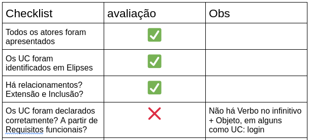

# Especificação dos Casos de Uso - VoyageX

  A especificação de casos de uso é uma técnica utilizada para capturar e descrever as interações entre um sistema e seus usuários. Eles fornecem uma visão detalhada de como o produto será utilizado na prática, ajudando a entender os requisitos funcionais. 

  Nesta atividade foi proposto a construção dos Casos de uso do aplicativo fictício VoyageX. Com isso, segue abaixo a especificação dos Casos de Uso de Explorar Destinos, Reservar Acomodação e Realizar Login. A seguir, é apresentado o diagrama demonstrando o comportamento do sistema.  

## Diagrama de Casos de Uso

<iframe allowfullscreen frameborder="0" style="width:600px; height:480px" src="https://lucid.app/documents/embedded/5e68cc99-8ac2-4845-9a48-001935e25b16" id="E~7THSsdRGx."></iframe>

## CDU-01 Explorar Destinos

| Número do Caso de Uso | CDU-01 |
| --- | --- |
| **Nome do Caso de Uso** | Explorar Destinos |
| **Versão** | 1.0 |
| **Data de Criação** | 06/12/2023 |
| **Responsável** | Jefferson e Tiago|

| **Breve Descrição** | O usuário explora artigos, fotografias e vídeos sobre destinos diversos para obter inspiração para suas viagens. |
| --- | --- |
| **Fluxo Básico de Eventos** | 
| Passo | Descrição |
| 1 | O usuário acessa a seção de "Explorar Destinos" no aplicativo. |
| 2 | O sistema utiliza algoritmos para sugerir destinos com base nas preferências e histórico de viagem do usuário. |
| 3 | O usuário seleciona um destino sugerido pelo sistema |
| 4 | O sistema mostra fotografias, artigos e vídeos sobre o destino |
| **Fluxos Alternativos** |
| **A1 Primeiro Fluxo Alternativo** | **Passo 2a**: Em vez de selecionar um destino sugerido pelo sistema, o usuário opta por realizar uma busca manual na seção "Explorar Destinos".   **Passo 2b**: O sistema permite que o usuário insira um destino específico de sua escolha.  **Passo 2c**: O sistema exibe informações (fotografias, artigos e vídeos) sobre o destino escolhido pelo usuário. |
| **A2 Segundo Fluxo Alternativo** | **Passo 4a**: O usuário consulta as atividades do destino ao invés de fotografias, artigos e vídeos.  **Passo 4b**: O sistema fornece todas as atividades que estão ocorrendo no destino explorado.  **Passo 4c:** O usuário filtra as atividades por preço e avaliações.  **Passo 4d**:O sistema fornece informações das atividades que estão ocorrendo no destino que está sendo explorado, satisfazendo os filtros selecionados. |
| **Fluxos de Exceção** |
| Número | Descrição |
| 1 | No passo 2, o usuário nunca ter acessado o aplicativo anteriormente e não possuir histórico. O sistema pede que o usuário preencha suas preferências ou realize a busca manualmente. |
| 2 | No Passo 2b do fluxo alternativo A1, o usuário insere um destino inexistente, o sitema deve notificar o usuário para inserir destinos existentes|
| **Pré-Condições** |
| Número | Descrição |
| 1 | O usuário realizou com sucesso o login na plataforma. |
| **Pós-Condições** |
| Número | Descrição |
|  1 | O usuário visualiza informações sobre diferentes destinos.
|  2 |O sistema está pronto para apresentar destinos sugeridos com base nas preferências e histórico do usuário.|
| **Requisitos Especiais** |
| Número | Descrição |
| 1 | O aplicativo deve ter acesso à internet para buscar informações atualizadas sobre destinos.|
| 2 |Os algoritmos de sugestão de destinos devem ser periodicamente atualizados para oferecer recomendações relevantes. |
|

## CDU-02 Reservar Acomodações

| Número do Caso de Uso | CDU-02 |
| --- | --- |
| **Nome do Caso de Uso** | Reservar Acomodações |
| **Versão** | 1.0 |
| **Data de Criação** | 06/12/2023 |
| **Responsável** | Jefferson e Tiago|

| **Breve Descrição** | O usuário realiza a reserva da viagem diretamente pelo aplicativo. |
| --- | --- |
| **Fluxo Básico de Eventos** | 
| Passo | Descrição |
| 1.1 | O usuário, após explorar destinos, decide reservar acomodações para um período específico da viagem. |
| 1.2 | O sistema filtra opções de hotéis, pousadas e atrações culturais disponíveis para o período determinado. |
| 1.3 | O usuário examina as opções disponíveis e seleciona uma pousada de interesse. |
| 1.4 | O sistema apresenta fotos e descrições detalhadas do local, bem como os diferentes pacotes de valores oferecidos. |
| 1.5 | O usuário escolhe um pacote específico, considerando características como comodidades, refeições incluídas e políticas de cancelamento. |
| 1.6 | Após a escolha do pacote, o sistema solicita a confirmação da reserva. |
| 1.7 | O usuário confirma a reserva, indicando a quantidade de hóspedes, informações de pagamento e quaisquer preferências adicionais. |
| 1.8| O sistema processa a reserva e fornece uma confirmação detalhada, incluindo as datas da estadia, custos associados e informações sobre a pousada. |
| 1.9 | Para facilitar a comunicação, o sistema disponibiliza um contato direto com o anfitrião, caso o usuário tenha perguntas ou solicitações específicas antes da chegada. |
| **Fluxos Alternativos** |
| **A1 Primeiro Fluxo Alternativo** | **Passo 4a**: Após o usuário selecionar uma pousada e visualizar os pacotes padrão oferecidos, ele decide personalizar sua reserva.   **Passo 4b**: Em vez de escolher um dos pacotes padrão, o usuário opta por personalizar a estadia selecionando serviços adicionais, como serviço de quarto, pacotes especiais de comemoração, ou tours locais.  **Passo 4c**: O sistema oferece opções de personalização, apresentando preços adicionais para cada serviço escolhido.   **Passo 4d**  O usuário faz suas escolhas personalizadas e adiciona os serviços desejados à reserva.    **Passo 4e** Após a personalização, o sistema recalcula o custo total da reserva com base nas escolhas feitas pelo usuário.        **Passo 4f** O usuário confirma a reserva com os pacotes personalizados e procede ao pagamento. |
| **Fluxos de Exceção** |
| Número | Descrição |
| 1 - Reserva Indisponível| FE1 - Se a pousada selecionada não tiver disponibilidade para o período escolhido, o sistema exibe uma mensagem informando que não há vagas.    FE2 - O usuário é incentivado a escolher datas alternativas ou explorar outras opções de acomodação. |
| 1 - Falha na Confirmação de Reserva| FE1 - Após a confirmação da reserva, se houver uma falha no processamento, o sistema exibe uma mensagem de erro.
    FE2 - O usuário é orientado a verificar as informações fornecidas, tentar novamente ou entrar em contato com o suporte. |
| **Pré-Condições** |
| Número | Descrição |
| 1 | O usuário realizou com sucesso o login na plataforma. |
| 2 | O usuário pesquisou e selecionou um destino específico para a viagem |
| **Pós-Condições** |
| Número | Descrição |
| 1 | A reserva foi concluída com sucesso, e o usuário recebeu uma confirmação detalhada. |
| 2 | O sistema está pronto para apresentar destinos sugeridos com base nas preferências e histórico do usuário para futuras viagens. |
| **Requisitos Especiais** |
| Número | Descrição |
| 1 | O aplicativo deve integrar-se a sistemas de reservas de hotéis e pousadas para fornecer informações em tempo real sobre disponibilidade. |
| 2 | Medidas de segurança robustas devem ser implementadas para proteger as informações de pagamento do usuário durante o processo de reserva. |
| 3 | O sistema deve fornecer uma interface de fácil utilização para garantir uma experiência de reserva eficiente. |
| |

## CDU-03 Realizar Login

| Número do Caso de Uso | CDU-03 |
| --- | --- |
| **Nome do Caso de Uso** | Realizar Login |
| **Versão** | 1.0 |
| **Data de Criação** | 06/12/2023 |
| **Responsável** | Jefferson e Tiago|

| **Breve Descrição** | Este caso de uso descreve o processo de um usuário autenticar-se no aplicativo para acessar funcionalidades personalizadas. |
| --- | --- |
| **Fluxo Básico de Eventos** | 
| Passo | Descrição |
| 1 | O usuário abre o aplicativo no dispositivo |
| 2 | O sistema exibe a tela de login, solicitando informações de identificação. |
| 3 | O usuário insere seu nome de usuário ou endereço de e-mail e senha |
| 4 | O sistema valida as credenciais inseridas |
| 5 | O aplicativo exibe a tela inicial personalizada com base no perfil do usuário. |
| **Fluxos Alternativos** |
| **1. Recuperação de Senha** | **Passo 1**: O usuário esqueceu a senha e seleciona a opção "Esqueceu a senha?".   **Passo 4b**: O sistema envia um link de redefinição de senha para o e-mail registrado  **Passo 4c**: O usuário acessa o link e redefine a senha. |
| **Fluxos de Exceção** |
| Número | Descrição |
| 1 - Credenciais Inválidas | FE1 - Se as credenciais inseridas (nome de usuário ou senha) não coincidirem com os registros do sistema, o sistema exibe uma mensagem de erro.    FE2 - O usuário é incentivado a escolher datas alternativas ou explorar outras opções de acomodação. |
| 1 - Falha na Confirmação de Reserva| FE1 - Após a confirmação da reserva, se houver uma falha no processamento, o sistema exibe uma mensagem de erro.
    FE2 - O usuário é convidado a revisar as informações e tentar novamente ou optar por recuperar a senha. |
 | 2 - Conta Bloqueada | FE1 - Se houver várias tentativas de login com falha, o sistema bloqueia temporariamente a conta por motivos de segurança.
    FE2 - O usuário é notificado sobre o bloqueio e orientado a aguardar um período antes de tentar novamente ou seguir o processo de recuperação de senha. |
| **Pré-Condições** |
| Número | Descrição |
| 1 | O usuário possui uma conta registrada no aplicativo. |
| **Pós-Condições** |
| Número | Descrição |
| 1 | O usuário é autenticado com sucesso e tem acesso às funcionalidades personalizadas do aplicativo. |
| 2 | O sistema registra a última atividade de login para fins de segurança e auditoria. |
| **Requisitos Especiais** |
| Número | Descrição |
| 1 | O sistema deve armazenar de forma segura as informações de login dos usuários, utilizando práticas de segurança adequadas, como criptografia de senha. |
| 2 | O aplicativo deve fornecer uma opção de "Lembrar-me" para usuários que desejam permanecer autenticados entre sessões. |
| |

## Checklist UC - Bersek

{width: 500}

## Histórico de versão

| Versão  | Autor| Descrição | Data |
| :---: | :----: | :-------: | :---: |
| 1.0| Jefferson e Tiago |  Especificação dos casos de uso do VoyageX | 06/12 |
| 1.1| Jefferson  |  Diagrama dos casos de uso do VoyageX e checklist Bersek | 06/12 |
