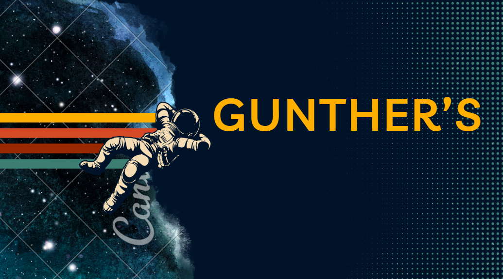

# Entregas

## Missão 1: Neutralização do Perigo Apache

1° Entrega: 12/09/2023 -
Definição de Ciclo de Vida, Abordagem e Processo
 
[Entrega 1](https://www.canva.com/design/DAFuL6830EA/tV1MUTEoWw-7mkQ6FOljVQ/edit?utm_content=DAFuL6830EA&utm_campaign=designshare&utm_medium=link2&utm_source=sharebutton)

2° Entrega: 19/09/2023 - Atividade de Engenharia de Requisitos conectada ao Processo de Software
 
[Entrega 2](https://www.canva.com/design/DAFuuk6hZ-Y/k3tKMkdcWC_qA2JAh4IvtQ/edit?utm_content=DAFuuk6hZ-Y&utm_campaign=designshare&utm_medium=link2&utm_source=sharebutton)

3° Entrega: 28/09/2023 - Entrega final missão 1

[VIDEO APRESENTAÇÃO](LINK DO VIDEO AQUI)

