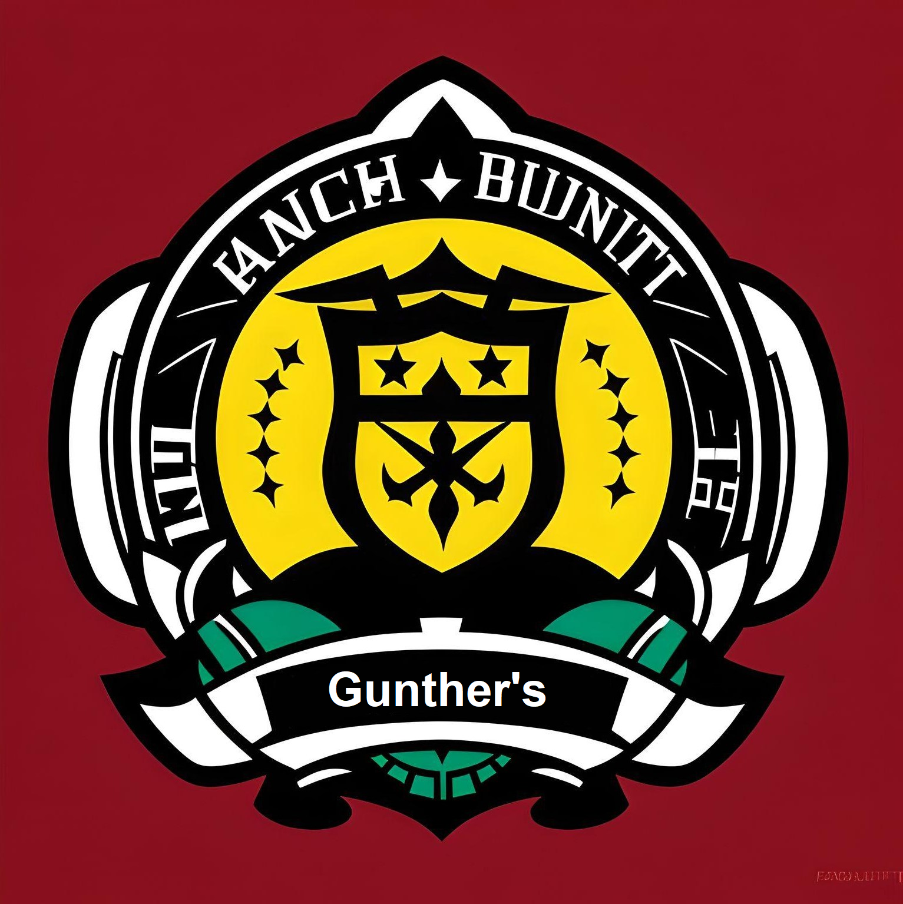

## Brasão

## História

Nos confins da galáxia de Calamum Caeruleum, onde o caos imperava devido à exploração espacial desenfreada e a ganância das corporações, uma facção singular surgiu: os "Gunther's” Sob a liderança carismática de Juan "Manel", um estrategista militar visionário, esta equipe improvável estava destinada a desafiar a tirania das corporações gananciosas que saqueavam planetas inteiros em busca de recursos preciosos.

A jornada dos "Gunther's" teve início quando Manel reuniu um variado grupo de caçadores de recompensas com o objetivo de capturar o líder fugitivo da Rebelião de Botaya, conhecido como CAD PIN, na lisongenia dos Asteroides. Após o êxito desta missão, todos perceberam que suas habilidades se complementavam e que poderiam evoluir ainda mais como caçadores, contribuindo mutuamente para o sucesso da facção.

Os Gunther's é formada pelo líder Juan "Manel”que possui a capacidade de prever movimentos estratégicos de seus oponentes, o ativista Jonas, especialista em infiltração e espionagem se camuflando em ambientes tornando-se quase invisível, o mestre na manipulação de sistemas de segurança Rek que desativa os recursos eletrônicos dos inimigos com um toque apenas, o atirador Mark especialista em armamentos e ataques estratégicos, o estrategista Zephyr Newdown que denota de grande conhecimento em estratégia militar e encontrar pontos fracos dos inimigos e o piloto Siesta com grande experiência em combate. 

Devido aos objetivos em comum com o Comando Estelar, os Gunther's uniram forças para estabelecer a paz em Calamum Caeruleum. Suas habilidades tornaram-se essenciais quando as grandes organizações desencadearam guerras incontroláveis. Tornou-se necessário uma nova força de elite, guerreiros que vão além das habilidades comuns. No entanto, essa missão revelou-se desafiadora como nunca visto antes.

## Descrição dos Integrantes
### Manel - Juan 

História: Mais conhecido como analista profundo, o fundador e líder da equipe nasceu em Lago-8, era uma mente estratégica respeitada no campo militar antes de criar a facção. Sua visão era forjar uma equipe unida para resistir às corporações destrutivas. Juan Manel era conhecido não apenas por suas habilidades táticas, mas também por seu profundo conhecimento da cultura local, que frequentemente desempenhava um papel crucial em suas missões.

Nave: "Analise vital" é a nave altamente personalizada de Juan, equipada com tecnologia de camuflagem e armamento avançado.

Poder Especial: Juan possui um dom único de prever movimentos estratégicos de seus oponentes. Isso permite que ele antecipe as ações do inimigo durante uma missão, tornando-o um estrategista invencível.

### Leandro - Jonas 

História: Jonas nasceu e cresceu em Quelb, uma cidade cuja economia girava em torno da exploração mineral. Desde jovem, ele aspirava a seguir o caminho tradicional de muitos de seus conterrâneos: estudar e trabalhar na indústria de mineração, buscando uma vida comum e estável. No entanto, a vida em Quelb estava longe de ser tranquila.

A cidade enfrentava conflitos constantes entre seus moradores e as empresas da Slitherium, um poderoso conglomerado de exploração mineral que havia se estabelecido na região. Esses confrontos não apenas dividiam a comunidade, mas também criavam tensões crescentes à medida que os recursos naturais se esgotavam.

Após décadas de exploração intensiva, Quelb começou a sofrer com a escassez de minérios, levando a uma crise econômica. A população, desesperada e com raiva, culpava a Slitherium. Essa raiva acumulada acabou explodindo em um conflito armado que deixou várias vítimas.
Jonas se alinhou com os revoltosos, que acreditavam que era hora de enfrentar as empresas de mineração. Contudo, essa escolha o colocou em uma posição perigosa, pois as forças da Slitherium começaram a persegui-lo junto com seus aliados.
Em um ato desesperado, Jonas decidiu roubar uma nave da Slitherium e fugir de Namekusei, seu planeta natal, sobrevivendo como um caçador de recompensas.

Nave: F-Zero é uma nave que pode parecer inofensiva à primeira vista, mas esconde armamento surpreendentemente poderoso já que era da Slitherium.

Poder Especial: Jonas tem a habilidade de se camuflar em quase qualquer ambiente fazendo com que se torne quase impossível perceber sua presença.

 
### Tiago - Rek D lawysk:

História: Nascido em Punk Sake Port, conhecido como planeta da bebida e um pequeno planeta de Calamum Caeruleum, que é uma espécie de hotel e ponto de parada para os caçadores de recompensas da Galáxia, por conta de seus bares. Rek foi abandonado quando ainda era um bebê por seu Pai que era um caçador de recompensas famoso de Calamum Caeruleum e foi adotado por um mecânico espacial aposentado.
Vendo todos os dias os caçadores de recompensa em sua terra Natal, Rek decidiu tornar-se o maior de todos os caçadores de recompensas de Calamun Caeruleum, mesmo contra a vontade de seu pai Agev. O Conhecimento de mecânica e engenharia de Agev, pai adotivo de rek lhe foi passado, então aos 12 anos, Rek já tinha sua nave Espacial a "Punk Bottle", que era literalmente uma nave em formato de uma garrafa de vinho, afinal no país da bebida era comum garrafas espalhadas por aí, então essa era sua referência.

O combustível era o maior problema para Rek, porém o país da bebida também era o maior fornecedor de combustíveis Espaciais da Galáxia, Rek durante 6 anos, "pegou emprestado" combustível e guardou para quando saísse para sua jornada. Após Punk Sake Port ser destruído pelo conflito armado do Grupo APACHE contra os caçadores de recompensas da região, Agev foi baleado no conflito, sem que Rek pudesse fazer nada. Então Rek fugiu para o espaço, jurando nunca esquecer das ações terríveis daquelas corporações que destruíram Calamun Caeruleum.

   

Nave: "Punk Bottle", nave em formato de garrafa de vinho, a cabine é como uma rolha que pode desacoplar e virar uma nave menor, ótima alternativa para fugas. Altamente rica em poder bélico;

Poder Especial: Rek é um mestre na manipulação de sistemas de segurança e tecnologia. Ele pode desativar dispositivos eletrônicos inimigos com um toque, fornecendo uma vantagem tática significativa.

 
### Jefferson - Mark

História: Mark nasceu em Lorth Q, um planeta tecnológico regido por um regime militar severo.
Quando jovem, foi moldado e forjado em um artilheiro de guerra habilidoso, mas a sede insaciável por riquezas e fama o levou a empreender incursões em diversos planetas, transformando-se em um caçador de recompensas formidável.

Sob a influência do temido Grupo Apache, Lorth Q se viu envolto em uma devastadora guerra civil contra o regime militar, resultando na trágica destruição de seu planeta natal. Apesar de suas habilidades, Mark não conseguiu salvar sua própria família, que sucumbiu durante o conflito. A perda de sua família e a testemunha da aniquilação de seu planeta natal incutiram em Mark uma feroz sede de vingança contra o Grupo Apache.
Mark então segue seu caminho como um destemido caçador de recompensas, caçando e eliminando alvos em todos os cantos da galáxia, infiltrando-se em organizações criminosas e destruindo-as pelo pagamento mais alto.

Nave: “Mercury” de design discreto, notável por sua velocidade e habilidade furtiva. Se destaca por seu formidável poder de fogo e artilharia pesada, tornando-a a escolha ideal para confrontos em curta e longa distância.

Poder Especial: Pontaria Absoluta. Com uma habilidade de mira inigualável, Mark se transformou em um exímio atirador após intensos treinamentos, capaz de acertar seus alvos com precisão tanto a curtas quanto a longas distâncias. Essa capacidade extraordinária lhe confere uma vantagem tática, permitindo-lhe eliminar seus inimigos com precisão absoluta. 

 
### Harry - Zephyr Newdown

História: Zephyr Newdown nasceu nas profundezas da metrópole futurista de Nova Argentum, uma das cidades mais avançadas da galáxia Calamum Caeruleum. Cresceu em um ambiente repleto de tecnologia de ponta e oportunidades de aprendizado. Desde jovem, Zephyr demonstrou habilidades excepcionais em lidar com dispositivos eletrônicos, robótica e computação, além disso era facinado com o espaço e suas possibilidades.

Enquanto a cidade prosperava em meio à ciência e à inovação, Zephyr desenvolveu um apetite voraz por conhecimento e poder. Ele sonhava em transcender os limites de Nova Argentum e explorar os recantos desconhecidos da galáxia. Essa ambição o levou a seguir uma carreira de caçador de recompensas, uma profissão que exigia não apenas sua engenhosidade tecnológica, mas também suas habilidades de combate.

Nave: "Atalho secreto" é equipada com dispositivos de fuga eficazes, e armas potentes refletindo o desejo por poder e liberdade,sua sagacidade tecnologica deu a ela o titulo de nave mais rápida de Nova Argentum, vencendo várias competições.

Poder Especial: Zephyr possui uma intuição sobrenatural quando se trata de estratégia. Ele pode identificar a melhor abordagem para qualquer situação quase instantaneamente, tornando suas decisões de liderança ainda mais eficazes, tambem tem grande inteligência financeira e sabe manejar os recursos da facção.

 
### João - Siesta 

História: João nascido em Gorg-28, o especialista em combate da equipe, tem uma abordagem única para o combate. Apesar de sua aparência não intimidante, ele é conhecido por derrotar seus inimigos enquanto parece estar entediado. Sua habilidade de combate excepcional e estilo exótico surpreendiam constantemente seus oponentes. 

Se tornou caçador de recompensas em busca de PAXs, a moeda mais valiosa em seu planeta natal. Seus objetivos eram acumular fortuna para financiar sua educação, entrando na maior faculdade de tecnologia da galaxia e evitar que seu lar seja alvo dos conglomerados. Entretanto durante sua busca incessante por PAXs acabou desenvolvendo uma obsessão por dinheiro, abandonando seus antigos sonhos e objetivos para se dedicar inteiramente a sua nova vida como caçador de recompensas. 

Nave: "Siesta Voadora" é equipada com armamento poderoso e temida por aqueles que cruzam o caminho dos "Gunther's".

Poder Especial: João tem um estado de combate semelhante a um transe. Quando ele entra nesse estado, seus movimentos se tornam incrivelmente precisos e rápidos, permitindo que ele derrote múltiplos inimigos com facilidade.

## Compromisso

Faremos o nosso melhor para honrar a nossa aliança com o Comando Estelar e nos comprometemos a cumprir todas as missões atribuídas à nossa facção com o objetivo de restabelecer a paz em Calamum Caeruleum

## Importância

Grande parte dos membros desta facção possuem interesse em desestabilizar os conglomerados pois já foram prejudicados por eles. As habilidades dos membros são diversas e úteis para cumprir esse objetivo e eles também possuem experiências adquiridas em outras aventuras. Tudo isso faz com que a presença desta facção se torne indispensável para esta missão.

 

