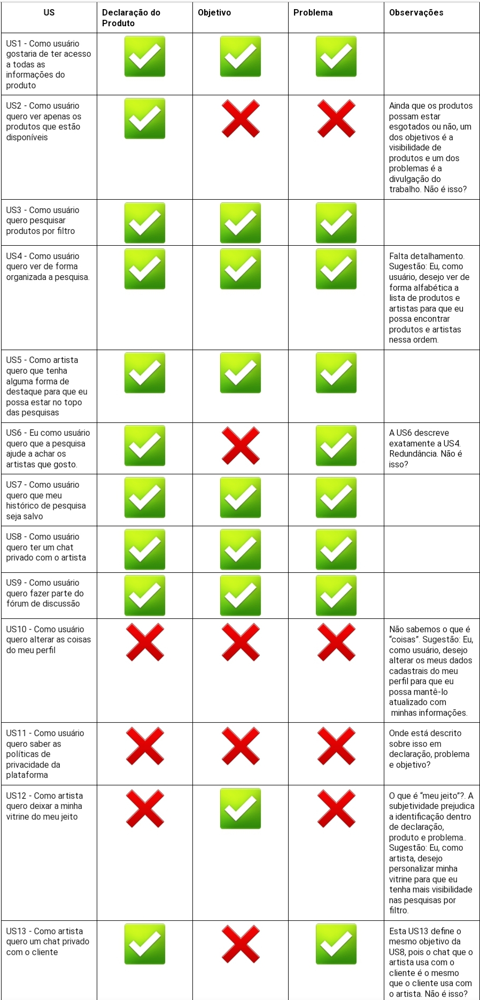
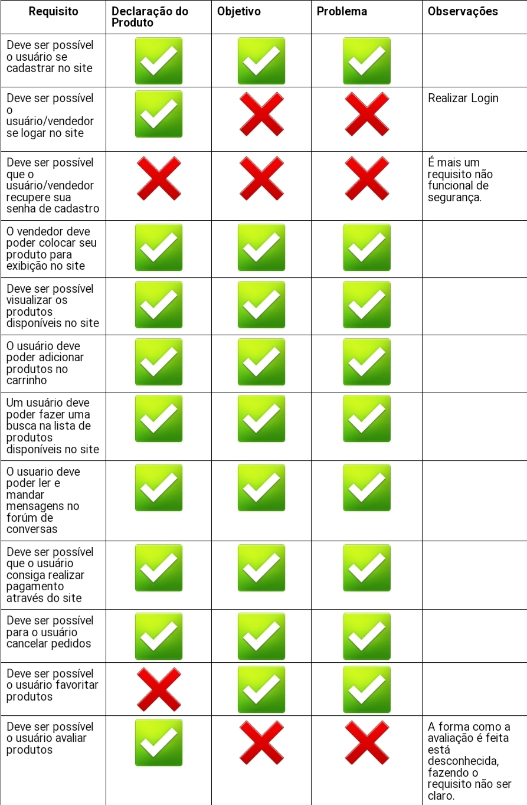
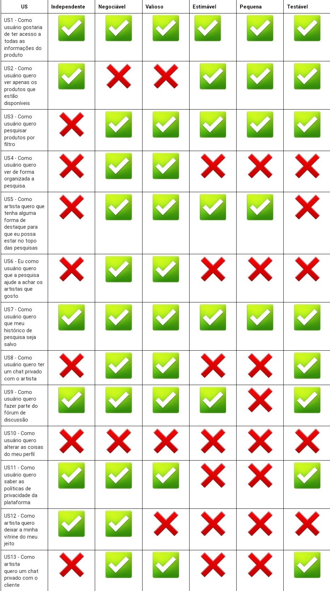
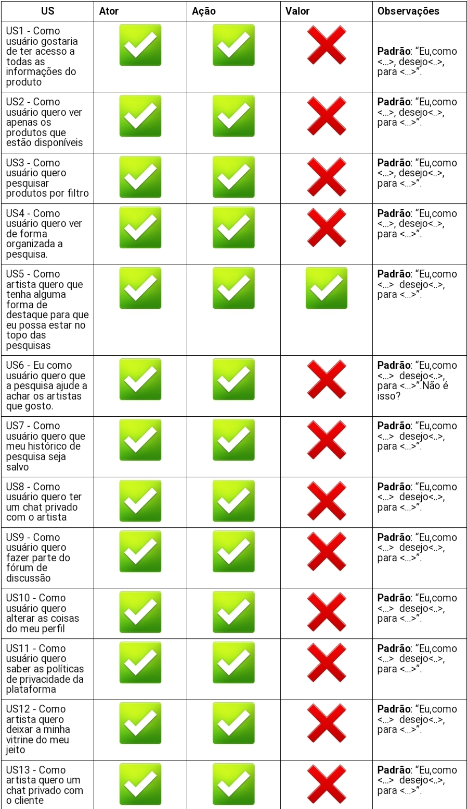
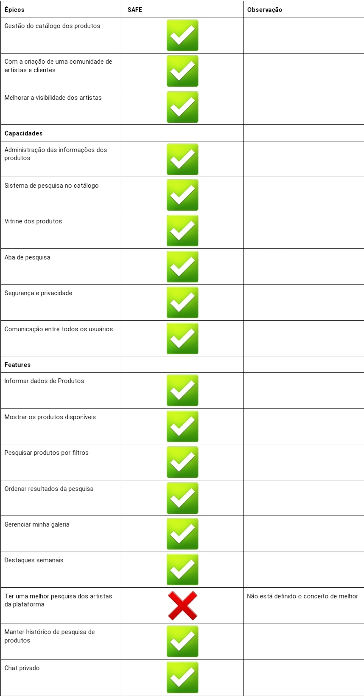
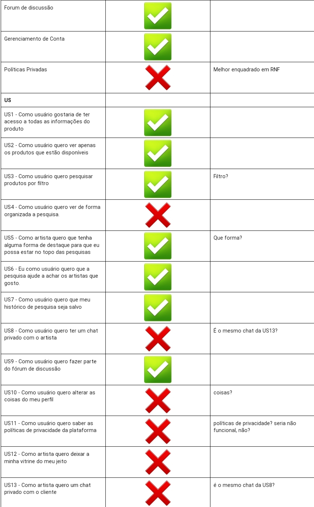

# Verificação e Validação Facção Bersek

## Introdução

Nós da facção Gunther's realizamos a validação e verificação do backlog do produto da facção Berserk, de acordo com a dinâmica proposta pelo comandante estelar <b>Marsicano</b>. Realizamos a atividade e retornamos feedbacks afim de ajudar na melhora desse artefato da outra facção, indicando pontos que estavam bons e pontos de melhoria. A equipe Berserk também realizou a mesma atividade com nosso backlog. A cooperação entre as facções é importante para a restauração da paz em Calamun Caereleum. 

## Técnicas

As técnicas utilizadas para a validação e verificação, foram:

 - Checklist;
 - INVEST;

## Tabelas das Avaliações

## Checklist: Declaração, Objetivo e Problema

 
 

## Checklist: Declaração, Objetivo e Problema

 
 

## INVEST (avaliação das US)

 
 

## Checklist: Ator, Ação e Valor

 
 

## Checklist: Backlog - SAFE

## Histórico de versão

| Versão  | Autor| Descrição | Data |
| :---: | :----: | :-------: | :---: |
| 1.0| Jefferson e Tiago |  Adicionando Verificação e Validação da Facção Bersek | 25/10 |